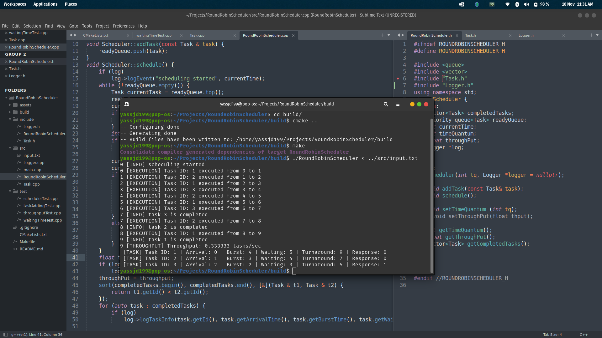
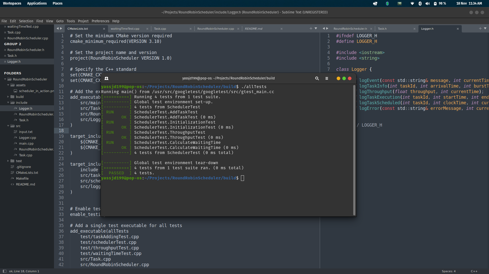

# Round Robin Scheduler

## Overview

This is a **Round Robin Scheduling** simulation program implemented in C++ that demonstrates the Round Robin (RR) CPU scheduling algorithm. The program simulates task scheduling, calculates the **waiting time**, **turnaround time**, **response time**, and **throughput** for a set of tasks, and logs all relevant events during the scheduling process.

## Features

- **Round Robin Scheduling**: The core algorithm used to simulate task scheduling.
- **Logging**: Task execution events, completion, and performance statistics.
- **Unit Testing**: The project uses Google Test (gtest) to perform unit tests on the scheduler’s functionality.
- **CMake**: The project uses CMake as the build system.

## Requirements

- **C++11** or higher
- **CMake** (for building)
- **Google Test** (for unit testing)

To install Google Test on a Linux-based system, use the following command:

```bash
sudo apt-get install libgtest-dev
```

## Installation

1. Clone the repository:

   ```bash
   git clone https://github.com/yassjd199/RoundRobinScheduler.git
   cd RoundRobinScheduler
   ```

2. Create the build directory and run CMake:

   ```bash
   mkdir build
   cd build
   cmake ..
   ```

3. Build the project:

   ```bash
   make
   ```

4. Optionally, you can run the unit tests using CTest:

   ```bash
   ctest
   ```

## Usage

The following format is expected in the input file:

1. **Time Quantum** (an integer)
2. **Number of Tasks** (an integer)
3. Each task is defined by the following:
   - **Task ID**
   - **Arrival Time**
   - **Burst Time**

### Example `input.txt`:

```
4
3
1 0 5
2 1 3
3 2 2
```

Where:
- **Time Quantum** = 4
- **Number of Tasks** = 3
- **Tasks**:
  - Task 1: ID = 1, Arrival Time = 0, Burst Time = 5
  - Task 2: ID = 2, Arrival Time = 1, Burst Time = 3
  - Task 3: ID = 3, Arrival Time = 2, Burst Time = 2

To run the scheduler with the input file:

```bash
./RoundRobinScheduler 
```

Alternatively, use an input file as follows:

```bash
./RoundRobinScheduler < /path/to/input.txt
```

### Output

The program will log detailed scheduling information, including **waiting time**, **turnaround time**, and **response time** for each task.

## Screenshots

### Scheduler in Action

Here is a screenshot of the **Round Robin Scheduler** in action, showing the task scheduling and performance logs:



### Testing Screenshot

This screenshot shows the **unit testing** output after running the Google Test cases for the scheduler:



## Testing

The project uses **Google Test** for unit testing. To run the tests, follow these steps:

1. Run the tests using the following command after building:

   ```bash
   make test
   ```

2. Alternatively, you can run CTest:

   ```bash
   ctest
   ```

Unit tests for the **Scheduler** class are located in the `test` directory, and can include tests for task addition, task scheduling, throughput, waiting time, etc.

## License

This project is licensed under the **MIT License** - see the [LICENSE](LICENSE) file for details.
```
